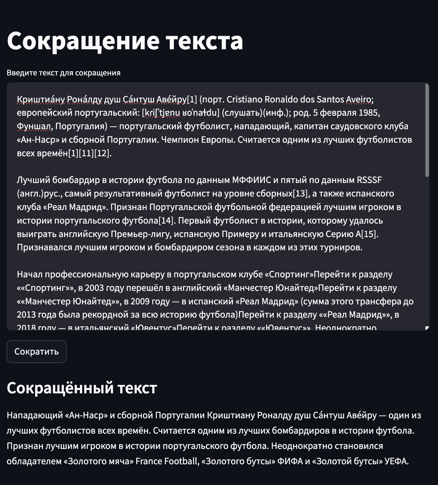

# Сокращение текста

Сервис позволяет сокращать тексты и выделять в них самое важное.

## Зависимости

Для управления зависимостями используется [Poetry](https://python-poetry.org/)

Чтобы установить все зависимости, необходимо выполнить команду

```shell
poetry install
```

Предварительно требуется установить Poetry

## Запуск

```shell
streamlit run app.py
```

## Использование

В поле ввода введите текст статьи и запустите процесс сокращения, кликнув на "Сократить".

Результат появится в поле ниже.
